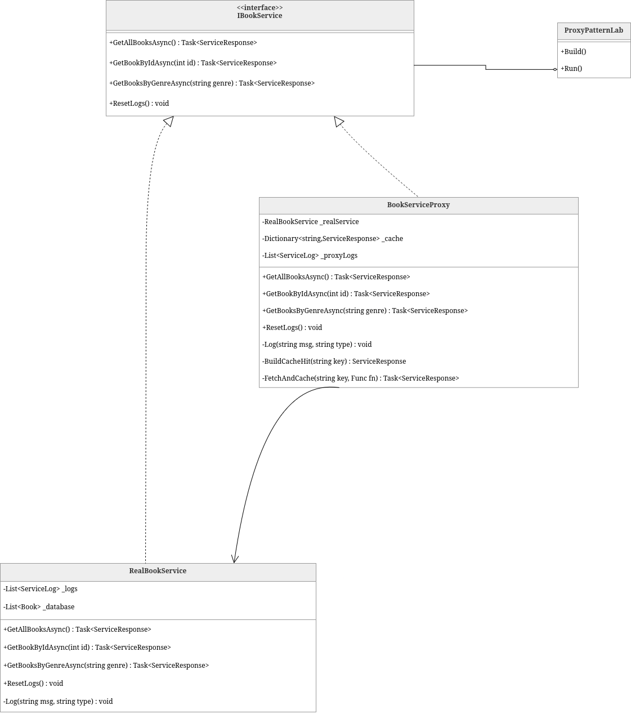

# Лаборатория шаблонов проектирования Proxy - C#

Веб-приложение, демонстрирующее структурный шаблон проектирования **Proxy** в сравнении с прямым (без использования прокси) доступом к тому же сервису.

## Run

```bash
docker compose up --build
```

```bash
xdg-open http://localhost:8080
```

### Stop the app

```bash
docker compose down
```

## На что обратить внимание

1. **Первый вызов**: обе панели работают медленно (~1-1,4 с) — у прокси-сервера ещё нет кэша.
2. **Повторить тот же запрос**: панель _С прокси_ возвращает данные из кэша менее чем за 1 мс;
   панель _Без прокси_ каждый раз обращается к базе данных.
3. **Сброс**: очищает кэш прокси-сервера, позволяя повторить эксперимент.
4. **Цвета в логах**: янтарный = операция с базой данных, фиолетовый = событие кэша, синий = информация.

---


