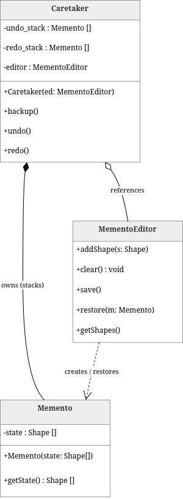

# Лабораторная работа 3: Графический редактор с функцией восстановления состояния

В этой лабораторной работе демонстрируется базовый графический редактор для простых геометрических объектов с возможностью пошагового восстановления состояний и отмены изменений (функции отмены/повтора).

## Архитектура

Проект содержит две различные реализации логики сохранения состояния для сравнения подходов:

1.  **Версия без паттерна**: Реализует историю изменений состояния (отмена/повтор) непосредственно в классе редактора, используя стеки векторных фигур.
2.  **Версия паттерна проектирования «Воспоминание»**: Использует паттерн Memento для отделения логики создания и восстановления состояния (`Memento`, `MementoEditor` и `Caretaker`) от основной функциональности редактора.

Обе версии используют одну и ту же структуру данных `Shape` и доступны через отдельные конечные точки REST API.

## Как Запустить

- Создайте и запустите сервисы с помощью Docker Compose.:
  ```bash
  docker-compose up --build
  ```
- Откройте веб-браузер и перейдите по адресу : http://127.0.0.1 (`http://localhost:80`)

## Использование

- **Выбор режима**: Переключение между реализациями бэкэнда "Без шаблона" и "Шаблон памяти". В каждом режиме поддерживается собственное отдельное состояние холста.
- **Добавление фигур**: Выберите тип фигуры (круг/прямоугольник), цвет и размер. Щелкните в любом месте холста, чтобы разместить объект.
- **Отменить/Повторить**: Совершите путешествие назад или вперед по истории государств.
- **Прозрачный**: Удаляет все фигуры с холста (это действие также сохраняется в истории).

## Схема


