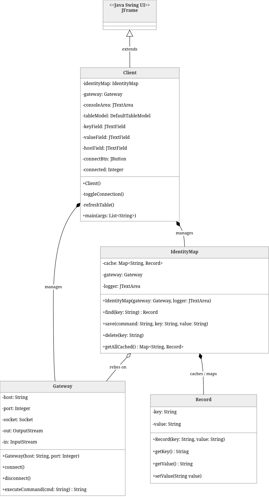

# Отчет по лабораторной работе

**Тема:** Интеграция базы данных MeowDB и реализация паттерна проектирования Identity Map.

## 1. Введение и цель работы

Цель данной лабораторной работы — разработать клиентское графическое приложение на языке Java для пользовательской базы данных MeowDB (написанной на C) с применением объектно-ориентированного паттерна проектирования **Identity Map**. Дополнительной задачей являлась полная контейнеризация проекта с использованием Docker для обеспечения независимости от платформы.

## 2. Архитектура системы

Система построена на классической клиент-серверной архитектуре и состоит из двух основных компонентов:

- **Сервер (Backend):** MeowDB, легковесный сервер базы данных типа ключ-значение (key-value), написанный на языке C. Сервер хранит данные в виде дерева и обрабатывает сырые TCP-соединения (команды `create`, `insert`, `select`, `update`, `delete`).
- **Клиент (Frontend):** Desktop-приложение на Java (Swing), выступающее в роли графического менеджера базы данных (GUI). Взаимодействие с сервером происходит через сокеты (Java Sockets).

## 3. Реализация паттерна Identity Map

Главной задачей клиентского приложения была демонстрация паттерна **Identity Map**. Этот паттерн используется для того, чтобы гарантировать, что каждый объект из базы данных загружается в память приложения только один раз за сессию, предотвращая дублирование данных и лишние сетевые запросы.

В коде был реализован класс `IdentityMap`, который содержит коллекцию `HashMap<String, Record>`:

1. **Cache Hit (Попадание в кэш):** При попытке пользователя получить запись по ключу (`select`), система сначала проверяет локальный кэш (Map). Если объект `Record` уже существует, он возвращается немедленно из памяти по той же ссылке.
2. **Cache Miss (Промах кэша):** Если ключа нет в кэше, приложение делает сетевой запрос к серверу MeowDB. Полученный ответ парсится, на его основе создается новый объект `Record`, который регистрируется в `HashMap` и выводится в интерфейсе.
3. Для доказательства работоспособности паттерна в графическом интерфейсе выводится уникальный адрес объекта в памяти (Memory Address). При повторных запросах одного и того же ключа адрес не меняется, что подтверждает использование паттерна.

## 4. Контейнеризация инфраструктуры

Для упрощения запуска и связывания компонентов, написанных на разных языках, был использован **Docker Compose**.

- **Контейнер MeowDB:** Собирается из базового образа GCC, автоматически клонирует исходный код сервера с GitHub и компилирует его с помощью `make`.
- **Контейнер Клиента:** Собирается на базе OpenJDK, компилирует Java-код и использует проброс X11-сокетов (X-Window System) для отображения графического интерфейса (GUI) изнутри изолированного контейнера прямо на экран хост-машины (например, в ОС Fedora/Linux).

## 5. Выводы

В ходе выполнения лабораторной работы были успешно закреплены принципы объектно-ориентированного проектирования. Паттерн Identity Map показал свою эффективность при работе с удаленными базами данных, существенно сократив количество избыточных TCP-запросов и обеспечив консистентность объектов в памяти Java-машины. Использование Docker позволило создать надежную среду, в которой C-сервер и Java-клиент работают в единой виртуальной подсети без необходимости сложной локальной настройки.

---

